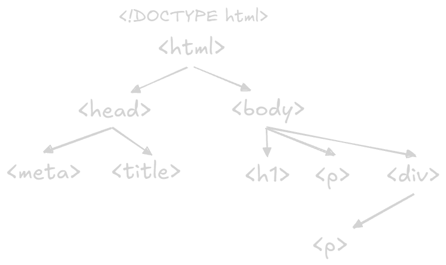

Welcome to the world of HTML (HyperText Markup Language) - the fundamental building block of every web page you see.
HTML is _not_ a programming language; it's a _markup language_.
This means it's used to describe the _structure_ and _content_ of a web page, not to program behavior (that's where JavaScript comes in).

## What is HTML?

HTML uses **tags** to "mark up" different parts of a document, telling the browser how to interpret and display them.
Think of it like using a highlighter and sticky notes to annotate a printed document.
You might highlight a heading, circle a key phrase, or add a note in the margin.
HTML tags do something similar, but for web browsers.

For example, you might use a tag to indicate that a certain piece of text is a heading, another tag to indicate that it's a paragraph, and another tag to create a link to another page.
The browser then uses these tags to render the page correctly, displaying headings in a larger font, paragraphs with appropriate spacing, and links as clickable text.

## HTML Tags: The Building Blocks

HTML tags are enclosed in angle brackets (`<` and `>`).
Most tags come in _pairs_: an opening tag and a closing tag.
The closing tag is identical to the opening tag, but with a forward slash (`/`) before the tag name.

Here's a simple example:

```html
<p>This is a paragraph of text.</p>
```

- `<p>` is the opening tag for a paragraph.
- `</p>` is the closing tag for a paragraph.
- `This is a paragraph of text.` is the content of the paragraph.

Some tags, however, are _self-closing_ (also called _empty_ tags or _void_ tags).
These tags don't have any content; they just provide information.
A common example is the `` tag, which is used to embed an image:

```html

```

Here, `` is a self-closing tag.
It doesn't have a closing `</img>` tag.
Instead, it has _attributes_ (`src` and `alt`) that provide information about the image.

## Attributes: Adding Detail to Tags

HTML tags can have **attributes**, which provide additional information about the element.
Attributes are always specified in the opening tag (or in the self-closing tag) and usually come in name-value pairs, like this:

```html
<a href="https://www.example.com">Visit Example Website</a>
```

- `<a>` is the tag for an anchor (a hyperlink).
- `href` is an attribute that specifies the URL of the link.
- `"https://www.example.com"` is the value of the `href` attribute.
- `Visit Example Website` is the text that will be displayed as a clickable link.

Different tags have different attributes, but some attributes are common to many tags, such as:

- `id`: A unique identifier for the element.
- `class`: A class name (or multiple class names) used for styling and scripting.
- `style`: Inline CSS styles.
- `title`: Provides advisory information about the element (often displayed as a tooltip on hover).

## A Simple HTML Document

Here's a very basic example of a complete HTML document:

```html
<!DOCTYPE html>
<html>
  <head>
    <title>My First Web Page</title>
  </head>
  <body>
    <h1>Hello, World!</h1>
    <p>This is my first paragraph.</p>
  </body>
</html>
```

Let's break this down:

- `<!DOCTYPE html>`: This is the _document type declaration_.
  It tells the browser that this is an HTML5 document (the latest version of HTML).
- `<html>`: This is the root element of the HTML document.
  All other elements are contained within it.
- `<head>`: This section contains metadata about the document - information that is _not_ displayed on the page itself, but is used by the browser or search engines.
  In this example, it contains the `<title>` tag.
- `<title>`: Specifies the title of the web page, which is displayed in the browser's title bar or tab.
- `<body>`: This section contains the _visible_ content of the web page - the text, images, links, etc., that users will see.
- `<h1>`: This is a heading tag (level 1 heading, the most important heading).
- `<p>`: This is a paragraph tag.

This simple example demonstrates the basic structure of an HTML document: a root `<html>` element containing a `<head>` section (for metadata) and a `<body>` section (for the visible content).
This is the basis of every website that you visit.



## HTML: The Skeleton, Not the Skin or Muscles

It's important to remember that HTML is about _structure_ and _content_, not about appearance.
You use HTML to define what the different parts of your page _are_ (headings, paragraphs, lists, images, etc.), not what they _look like_.
The _appearance_ of the page is controlled by CSS (Cascading Style Sheets), and the _behavior_ is controlled by JavaScript.
Think of HTML as the skeleton, CSS as the skin and clothing, and JavaScript as the muscles and nervous system.

In the following pages, we'll explore more HTML tags, attributes, and the overall structure of HTML documents in greater detail.
