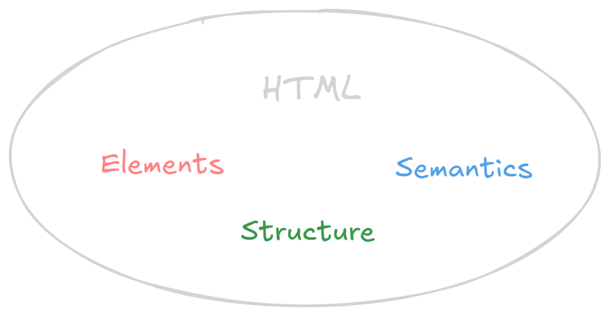

You've now gone through the core concepts of HTML: [elements](./elements), [structure](./structure), and [semantics](./semantics). You know how to create individual tags, how to organize them into a document, and how to give your content meaning. But _why_ is all of this important? Why should you spend time learning HTML when there are so many other things to learn in web development?

Let's connect the dots and see why a solid foundation in HTML is absolutely crucial for anyone who wants to build for the web.

## The Foundation of Everything

Simply put, **HTML is the foundation of every web page**. It's not just a markup language; it's the skeleton upon which you build the entire user interface. No matter what fancy frameworks or libraries you use later on, they all ultimately rely on HTML to render content in the browser. If you don't understand HTML, you won't be able to effectively use those frameworks.

Think of it like this: You can't build a house without a foundation. HTML is that foundation for websites.

## Connecting the Concepts

You now understand the importance of:

- **Elements:** The individual building blocks (tags) that make up your content. Without knowing the different HTML elements and what they do, you can't even begin to create a web page.
- **Structure:** The way you organize those elements into a well-formed HTML document. A good structure provides the browser with essential information about the content and helps with accessibility and SEO. Without structure, your page will be a jumbled mess.
- **Semantics:** Using the _right_ elements for the _right_ purpose, based on their meaning. Semantic HTML is what makes your page accessible, SEO-friendly, and maintainable. Without semantics, your code will be harder to understand and less effective.

These three concepts work together. You need elements to create content, structure to organize that content, and semantics to give that content meaning.

## Practical Benefits of Mastering HTML

A strong understanding of HTML provides several practical benefits:

- **You can build _anything_:** Once you know HTML, you can create _any_ type of web page, from simple static sites to complex web applications. You'll be able to structure content, add images and videos, create forms, and much more.
- **You can work with any framework:** React, Angular, Vue.js, Svelte... all of these frameworks generate HTML. Knowing HTML makes it much easier to understand how these frameworks work and to debug problems.
- **You can optimize for SEO:** Search engines rely on HTML to understand the content and structure of your website. By using semantic HTML and following best practices, you can improve your search engine rankings and attract more traffic.
- **You can ensure accessibility:** HTML is the key to making your website accessible to users with disabilities. By using semantic HTML and following accessibility guidelines, you can create a website that is usable by everyone.
- **You can write clean, maintainable code:** Well-structured, semantic HTML is much easier to read, understand, and maintain than poorly written code. This will save you time and effort in the long run, and it will make it easier for other developers to work with your code.
- **You can communicate your ideas:** You can represent any information, using html.

## HTML is Just the Beginning

It's important to remember that HTML is just one piece of the puzzle. You also need to learn CSS to style your content and JavaScript to add interactivity. But HTML is the _foundation_. Without a strong understanding of HTML, you'll struggle to master CSS and JavaScript.

So, embrace HTML. Learn it well. Experiment with different elements, structures, and semantics. The more you understand HTML, the better web developer you'll be.
