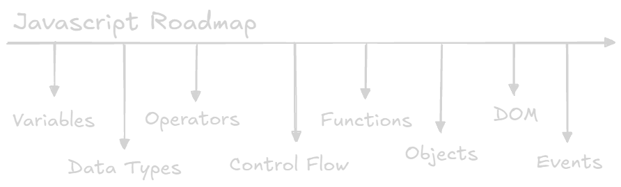

You've learned HTML to structure your content and CSS to style it.
Now it's time to add some _life_ to your web pages with **JavaScript**! JavaScript is a programming language that allows you to add interactivity, dynamic behavior, and complex logic to your websites.
It's what makes web pages respond to user actions, update content in real-time, and communicate with servers behind the scenes.

## What is JavaScript?

Think of HTML as the skeleton, CSS as the skin and clothing, and JavaScript as the muscles and nervous system.
HTML provides the structure, CSS provides the style, and JavaScript provides the _behavior_.

JavaScript enables you to:

- Respond to user interactions (e.g., button clicks, form submissions, mouse movements).
- Modify the HTML and CSS of a page dynamically.
- Validate user input.
- Create animations and visual effects.
- Fetch data from servers and update the page without reloading.
- Create complex web applications with rich user interfaces.
- And much, much more!

## JavaScript Beyond Browsers

While JavaScript was originally designed for web browsers, it's now used in a wide range of environments, including:

- **Server-side development:** [Node.js](https://nodejs.org/) allows you to use JavaScript to build server-side applications.
- **Mobile app development:** Frameworks like [React Native](https://reactnative.dev/), [Expo](https://expo.dev/), and [NativeScript](https://nativescript.org/) allow you to use JavaScript to build native mobile apps for iOS and Android.
- **Desktop app development:** Frameworks like [Electron](https://www.electronjs.org/) allow you to use JavaScript to build cross-platform desktop applications.
- **Game development:** JavaScript can be used to create browser-based games.
- **Internet of Things (IoT):** JavaScript is being used to develop applications for connected devices.

## How JavaScript Works

When a web browser loads an HTML page, it parses the HTML and creates a Document Object Model (DOM) - a tree-like representation of the HTML structure.
JavaScript can then access and manipulate the DOM to modify the content, style, and structure of the page.

You can include JavaScript code in your HTML in two main ways:

1.  **Inline JavaScript:** You can embed JavaScript code directly within HTML elements using event attributes (e.g., `onclick`, `onload`).
  This is generally not recommended for larger projects.

```html
<button onclick="alert('Hello!')">Click Me</button>
```

2.  **External JavaScript Files:** You can create separate `.js` files and link them to your HTML document using the `<script>` element in the `<head>` or `<body>` section.
  This is the recommended approach for most projects.

```html
<!DOCTYPE html>
<html>
  <head>
    <title>My Page</title>
    <script src="script.js"></script>
  </head>
  <body>
    <h1>My Heading</h1>
    <button>Click Me</button>
  </body>
</html>
```

In the `script.js` file:

```javascript
const button = document.querySelector("button");
button.addEventListener("click", function () {
  alert("Hello!");
});
```

## Key Concepts

- **Variables:** Used to store data.
- **Data Types:** Different types of data that variables can hold (e.g., numbers, strings, booleans, objects).
- **Operators:** Used to perform operations on data (e.g., addition, subtraction, comparison).
- **Control Flow:** Used to control the order in which code is executed (e.g., `if` statements, `for` loops, `while` loops).
- **Functions:** Reusable blocks of code.
- **Objects:** Collections of data and functions that operate on that data.
- **The DOM (Document Object Model):** A tree-like representation of the HTML structure that JavaScript can access and manipulate.
- **Events:** Actions or occurrences that happen in the browser (e.g., button clicks, mouse movements, page loads) that JavaScript can respond to.

We will explore all of these in the following pages.



## Let's Add Some Magic!

JavaScript is a powerful and versatile language that opens up a world of possibilities for creating dynamic and interactive web experiences.
In the following sections, we'll dive deeper into JavaScript syntax, concepts, and techniques.
Let's add some magic to your web pages!
