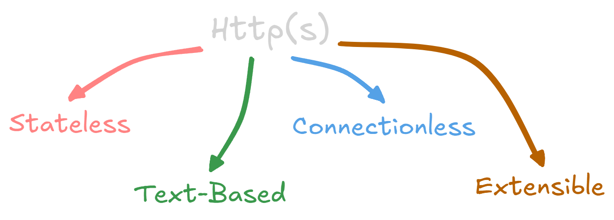

You've explored how devices find each other (IP addresses), how names are translated to addresses (DNS), and how resources are addressed (URLs).
Now, let's dive into the _language_ that clients and servers use to communicate: **HTTP (Hypertext Transfer Protocol)**.
HTTP is the foundation of data exchange on the World Wide Web.
It's the set of rules that governs how browsers request information from servers and how servers respond.

## What is HTTP?

HTTP is an _application-layer protocol_ designed for transmitting hypermedia documents, such as HTML.
Think of it as the agreed-upon set of rules and vocabulary that allows a web browser (the client) and a web server to understand each other.
It defines the format of requests and responses, ensuring that both sides know what to expect.

Without HTTP, the web as we know it wouldn't exist.
Browsers wouldn't know how to ask for web pages, and servers wouldn't know how to send them.
It's the underlying protocol that makes browsing, downloading files, and interacting with web applications possible.

## The Request-Response Cycle: The Core of HTTP

HTTP is based on a simple but powerful **request-response cycle**:

1.  **Client Sends a Request:** A [client](./client-server/client) (usually a web browser) initiates communication by sending an HTTP request to a server.
    This request includes information about what the client wants (e.g., a specific web page) and how it wants it (e.g., using the GET or POST method).
2.  **Server Processes the Request:** The [server](./client-server/server) receives the request, interprets it, and performs the necessary actions.
    This might involve retrieving a file, running a script, accessing a database, or performing other operations.
3.  **Server Sends a Response:** The server sends an HTTP response back to the client.
    This response includes a status code (indicating success or failure) and the requested data (e.g., the HTML code for a web page, an image, or an error message).
4.  **Client Processes the Response:** The client (browser) receives the response, interprets the status code, and displays the data to the user (e.g., rendering a web page).

This entire cycle happens, often in a fraction of a second, every time you click a link, load a page, or submit a form on the web.

## Key Features of HTTP

- **Stateless:** HTTP is a _stateless_ protocol.
  This means that each request is independent of previous requests.
  The server doesn't remember any information about past interactions with the client.
  This simplifies server design, but it also means that techniques like cookies or sessions are needed to maintain state (e.g., to keep you logged in to a website).
- **Text-Based:** HTTP messages (requests and responses) are text-based, making them human-readable (to a degree).
  This can be helpful for debugging.
- **Extensible:** HTTP is designed to be extensible.
  New features and functionalities can be added without breaking existing systems.
- **Connectionless:** After the server responds to the request, the connection between the client and the server is closed

