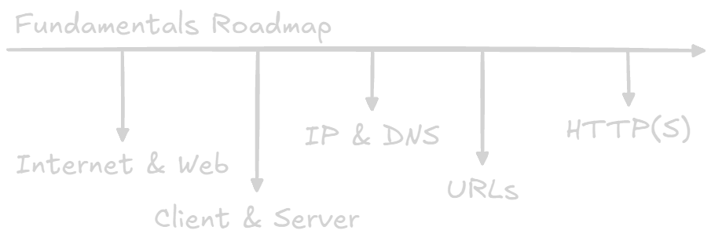

Welcome! You're about to embark on a journey to understand the basic ideas behind the web.
This knowledge is essential for _anyone_ who wants to build websites, web applications, or even just understand how the online world works.
Think of this as building a strong foundation for a house - without it, everything else will be shaky.

This guide is designed to be clear, concise, and accessible, even if you're completely new to web development.
We'll avoid technical terms as much as possible, and we'll focus on the practical implications of each concept.

## What You'll Learn

We'll be covering these core topics:

1.  **The Internet vs. The Web:** Understanding the difference between the underlying infrastructure (the internet) and the service that runs on top of it (the Web).
    It's like learning the difference between roads and the cars that drive on them.
2.  **Clients and Servers:** The fundamental interaction that powers the web.
    You'll learn how web browsers (clients) request information from servers, and how servers respond.
3.  **IP Addresses and DNS:** How devices find each other on the internet.
    You'll learn about IP addresses (like digital addresses) and DNS (the internet's phone book).
4.  **URLs (Uniform Resource Locators):** The addresses you type into your browser to access web pages and other resources.
    You'll learn how to decode their structure and understand what each part means.
5.  **HTTP (Hypertext Transfer Protocol):** The language that clients and servers use to communicate.
    You'll learn about request methods (like GET and POST), response status codes (like 200 OK and 404 Not Found), headers (metadata about the request or response), and the secure version, HTTPS.

## Why This Matters

This isn't just abstract theory.
These concepts are the foundation of _everything_ you'll do as a web developer:

- **Building Websites:** You'll be creating web pages that are accessed via URLs, served by web servers, and requested by clients (browsers).
- **Writing Code:** Your code (whether it's HTML, CSS, JavaScript, Python, PHP, Ruby, Java, or something else) will interact with the internet and the Web using these principles.
- **Debugging:** When things go wrong (and they will!), understanding these concepts will help you diagnose and fix problems.
- **Performance:** You'll be able to optimize your websites and applications for speed and efficiency.
- **Security:** You'll understand how to protect your applications and user data from attacks.

## How to Use This Guide

This guide is structured as a series of interconnected pages.
Each page focuses on a specific concept and builds upon the previous ones.
We recommend reading through the pages in order, but you can also jump around if you're already familiar with some of the topics.

Each page will:

- **Explain the concept clearly:** Using simple language and analogies.
- **Provide examples:** Showing you how the concept works in practice.
- **Highlight the "Why it matters":** Connecting the concept to the practical work of web development.

## Let's Get Started!

Ready to dive in? Let's begin by exploring the difference between the _internet_ and the _Web_ - a distinction that's often misunderstood, but crucial to understand.
Turn to the next page to start your journey!
